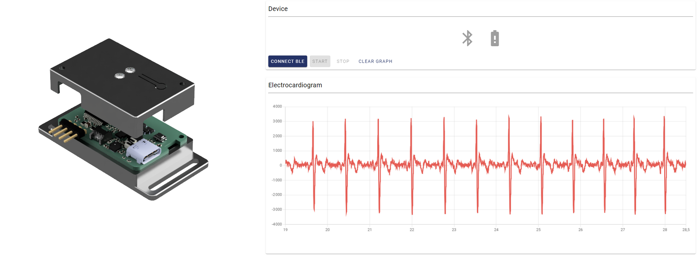

<p align="center">
    
</p>
<p align="center"><h1 align="center">Nervous ECG</h1></p>

<p align="center">
	<a href="https://opensource.org/licenses/MIT"></a>

## Table of Contents

- [Table of Contents](#table-of-contents)
- [Overview](#overview)
- [Features](#features)
- [Instructions](#instructions)
- [Contributing](#contributing)
- [Contact](#contact)
- [License](#license)
- [Acknowledgments](#acknowledgments)

---

## Overview

The **Nervous** initiative is a project embracing open-hardware and open-source principles, with the goal of delivering wearable sensors and accompanying software for the analysis of Autonomic Nervous System (SNA) activity.

The **Nervous ECG** project is part of the **[Nervous Toolkit](https://github.com/sensors-inl/Nervous-Toolkit)** and contains hardware design files and firmware source files for the design of an electrocardiography (ECG) sensor to collect ECG signal on the hands or forearms.
The device is wireless and send the signal acquired using Bluetooth Low Energy.



## Features

The project is actually a collection of three projects for the design of the
sensor which live in the three following subdirectories:

[hardware](./hardware/): Contained within this folder are ECAD files for the production of PCBs and the assembly of circuits for a wireless, wrist-worn ECG sensor.

[firmware](./firmware/): This folder contains sources to build binaries for the programming of the microcontroller.
Pre-built binaries are also attached to releases of this project.

[web-app](./web-app/): This sensor is primarily intended to be used with the ```nervous-sensors``` Python package included in the Nervous project toolkit.
However, a standalone web-application is provided for simple usage of the sensor, including sensor control, real-time data visualization and recording.

## Instructions

Detailed instructions are given in each subdirectory in order to manufacture and use the sensor.

## Contributing

Contributions are what make the open source community such an amazing place to learn, inspire, and create. Any contributions you make are greatly appreciated. You can open an issue to report a bug, request a feature, or submit a pull request.

## Contact

Bertrand MASSOT - [bertrand.massot@insa-lyon.fr](mailto:bertrand.massot@insa-lyon.fr)

## License

This project, like the entire Nervous initiative, is protected under the [MIT License]([LICENSE.md](https://opensource.org/licenses/MIT)) License. For more details, refer to the [License](LICENSE.md) file.

## Acknowledgments

Main contributors for this project are Bertrand Massot, Matthieu Mesnage and Hugo Buy from 
INSA Lyon, CNRS, INL UMR 5270, Villeurbanne, France.

This work was supported by the French National Reasearch Agency (ANR) under the grant ANR-22-CE31-0023-03 RENFORCE.
