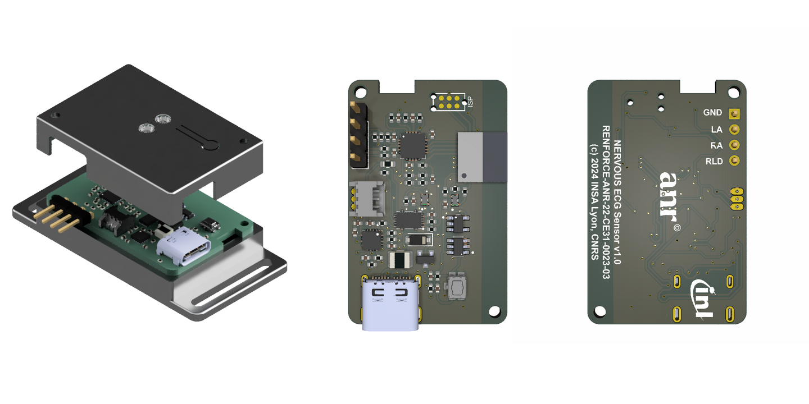

    <h1 align="center">Nervous ECG Hardware</h1>

    
    

## Table of Contents

- [Table of Contents](#table-of-contents)
- [Overview](#overview)
- [Hardware features](#hardware-features)
- [Manufacturing and assembling](#manufacturing-and-assembling)
  - [PCB properties for manufacturing](#pcb-properties-for-manufacturing)
- [Modification](#modification)
- [Casing](#casing)
- [Note on cables and electrodes placement to reduce signal noise](#note-on-cables-and-electrodes-placement-to-reduce-signal-noise)
- [Release](#release)

---

## Overview

This folder contains ECAD files for the production of PCBs and assembly of circuits for the Nervous ECG sensor.
The printed circuit board was designed using the open source electronics design automation suite [KiCad EDA](https://www.kicad.org/) v7.0.8

Originally designed for measuring heart rate via electrodes placed on the forearms or hands, this sensor utilizes the AD8232 along with passive components, as described in the "EXERCISE APPLICATION: HEART RATE MEASURED AT THE HANDS" section on page 27 of the [datasheet](<https://www.analog.com/media/en/technical-documentation/data-sheets/ad8232.pdf>).
You can modify this configuration for different applications and electrode placements.

The microcontroller used is the nRF52840 (Nordic Semiconductor) within the ISP1807 System-in-Package (Insight SiP).

---

## Hardware features

- USB-C connector for charging the battery
- Embedded LiPo battery charger and I2C fuel gauge
- On/Off SPST button (enables/disables the voltage regulator)
- RGB status LED
- AD8232 ECG AFE with a 7 Hz - 24 Hz bandpass filter (56 dB @ 13 Hz) and RLD
- nRF52840 (ISP1807) with Bluetooth Low Energy

---

## Manufacturing and assembling

The following files are available in the `Export` folder:

- **Export/Manufacturing**: contains Gerber (.gbr) and drill files (.drl)
- **Export/Assembly**: contains assembly drawing (.pdf), pick and place files (.pos), and BOM (.csv)

---

### PCB properties for manufacturing

Some PCB manufacturers may require the following properties. The table below summarizes the principal PCB properties:

| Property                    | Value              |
| --------------------------- | ------------------ |
| Dimensions                  | 21.5 mm x 33.5 mm  |
| Number of layers            | 2                  |
| Minimal insulation width    | 0.150 mm           |
| Minimal trace width         | 0.150 mm           |
| Minimal hole size           | 0.200 mm           |

---

## Modification

The `Source` folder contains the original KiCad project, created using KiCad version 7.0.8.

---

## Casing

Several 3D models are available for producing a casing for the electronics. STEP and STL files are located in the `Casing` folder:

- **casing_top** and **casing_bottom** are two parts that assemble together with two M2 screws, where the PCB and a 150 mAh LiPo battery fit. A specially designed battery compartment ensures that it does not overlap with the antenna of the ISAP1807 chip located on the longitudinal edge of the PCB. The design of the bottom part includes handles for wrist attachment.
- **casing_bottom_controller** is a modified version of the bottom part, designed to mount the electronics circuit and battery onto a Valve Index controller for ECG assessment during virtual environment sessions.

---

## Note on cables and electrodes placement to reduce signal noise

This sensor is designed to capture ECG signals under various conditions while minimizing discomfort. To achieve this, it uses high gain to support electrode placement on the hands or forearms, where signal strength is typically lower. However, this placement also amplifies sensitivity to motion artifacts, which can affect heart rate accuracy.

To minimize these artifacts, we recommend using solid gel electrodes, such as the 3M&reg; 2650. The sensor features a simple 2.54 mm, 3-way header for custom electrode connections. It is recommended to use short cables for the two electrodes near the device (RLD and RA), and a longer cable for the third electrode on the opposite arm (LA). The cables are designed with female crimp terminals at the sensor end and snap adapters at the electrode end. We recommend using cables with low triboelectric effect, such as Belden 9239 Low Noise Coaxial cable. To reduce noise from connector friction, securely hold the electrodes and cables near the electrodes with medical tape.

---

## Release

The entire folder is provided as an archive (`Nervous-ECG-hardware-vX.X.X.zip`) in the [releases](https://github.com/sensors-inl/Nervous-ECG/releases/latest) of this project.

---
